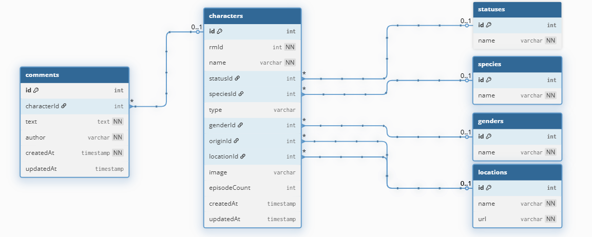

# Rick and Morty App

## Summary

This application is a full-stack Rick and Morty character explorer. Users can browse characters, apply filters by status, species, gender, origin, and sorting (A-Z / Z-A), and add comments to each character. The frontend is built with React, the backend uses Node.js with Apollo GraphQL, and PostgreSQL is used as the database with Redis for caching.

---

## Technology Stack

- **Frontend:** React 18.2.0, TailwindCSS, Apollo Client
- **Backend:** Node.js, Apollo Server, Sequelize ORM
- **Database:** PostgreSQL
- **Cache:** Redis
- **Containerization:** Docker & Docker Compose
- **GraphQL API** for data fetching and mutations

---

## ERD


---

## Getting Started

### Prerequisites

- Docker & Docker Compose installed
- Node.js 22+ (for local development, optional with Docker)

---

### Environment Variables

Clone the repo:
```dotenv
https://github.com/Lmanti/rick-and-morty-app.git
```

Create a `.env` file at the root of the project with the following variables (example):

```dotenv
COMPOSE_FILE=docker-compose.yml
COMPOSE_PROJECT_NAME=rick-and-morty-app

NODE_ENV=development

# Database
DB_HOST=rick-morty-db
DB_PORT=5432
DB_NAME=rickmorty
DB_USER=postgres
DB_PASS=postgres

# Redis
REDIS_HOST=redis
REDIS_PORT=6379
REDIS_PREFIX=rm:

# Backend
BACKEND_PORT=4000
API_GRAPHQL_URL=http://localhost:4000/graphql

# Frontend
FRONTEND_PORT=3000
```

---

### Running the Application

Start all services with Docker Compose:

```dotenv
docker-compose up --build
```

This will start:

- PostgreSQL database
- Redis cache
- Backend server (with migrations and seeds)
- Frontend React application

---

### Access the application:

- Frontend: http://localhost:3000
- GraphQL Playground: http://localhost:4000/graphql

---

## API Documentation

The backend exposes a GraphQL API with the following operations:

### Queries

#### Get all characters:

```dotenv
query GetCharacters($filter: CharacterFilter) {
  characters(filter: $filter) {
    id
    name
    image
    status { name }
    species { name }
    gender { name }
    origin { name }
    location { name }
    comments { text author createdAt }
  }
}
```

#### Get a single character:

```dotenv
query GetCharacter($characterId: Int!) {
  character(id: $characterId) {
    id
    name
    status { name }
    species { name }
    gender { name }
    origin { name }
    location { name }
    type
    image
    episodeCount
    comments { text author createdAt }
  }
}
```

#### Get filter options:

```dotenv
query GetFilterOptions {
  filterOptions {
    speciesOptions
    statusOptions
    genderOptions
    originOptions
  }
}
```

#### Get comments for a character:

```dotenv
query GetComments($characterId: Int!) {
  comments(characterId: $characterId) {
    id
    text
    author
    createdAt
  }
}
```

### Mutations

#### Add a comment to a character:

```dotenv
mutation AddComment($input: CommentInput!) {
  addComment(input: $input) {
    id
    text
    author
    createdAt
  }
}
```

#### CommentInput structure:

```dotenv
{
  "characterId": 1,
  "text": "This is a comment",
  "author": "John Doe"
}
```

---

## Features

- List and view character details
- Apply filters by name, status, species, gender, origin
- Sort characters A-Z / Z-A
- Add and view comments per character
- Fully dockerized frontend, backend, database, and cache
- Single-command setup using Docker Compose